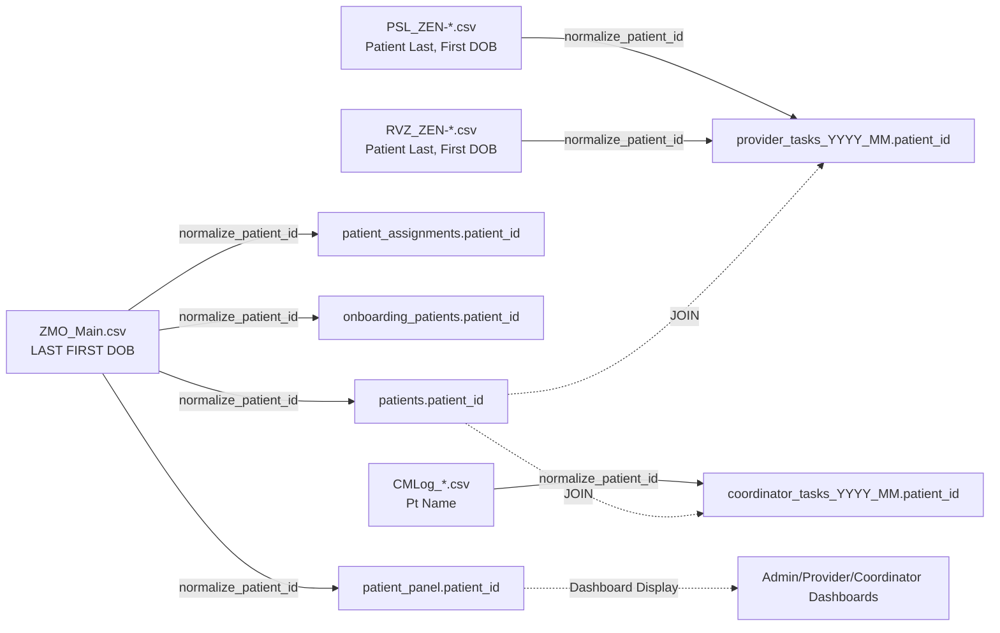
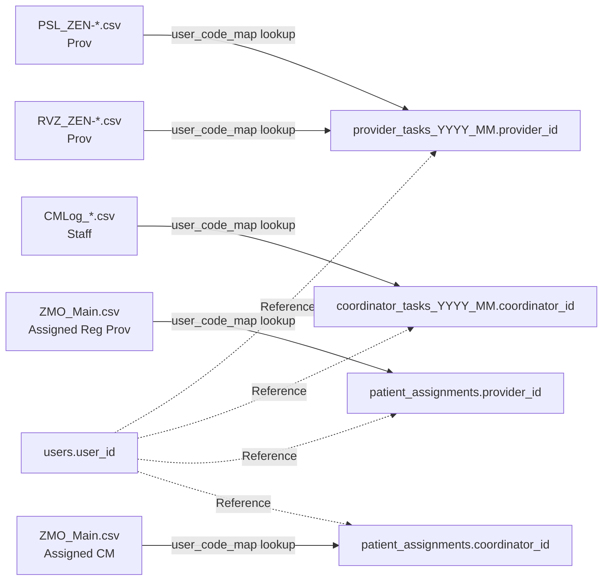
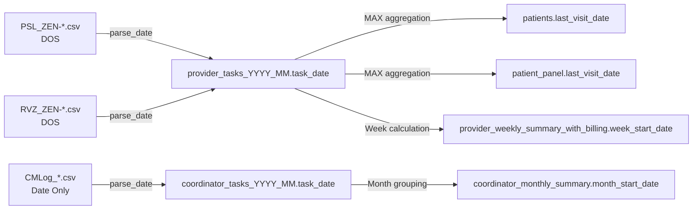
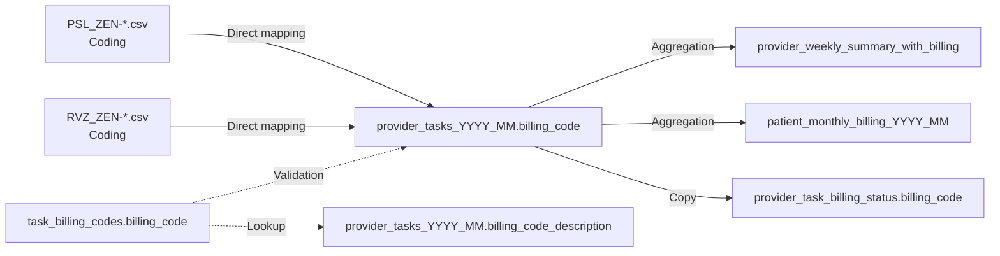
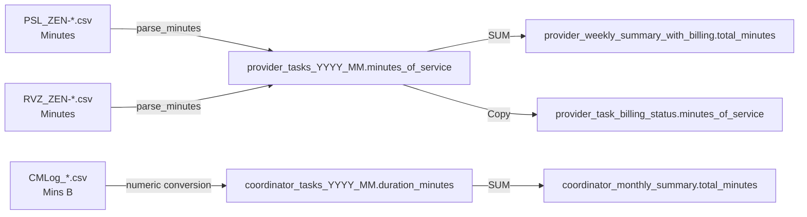
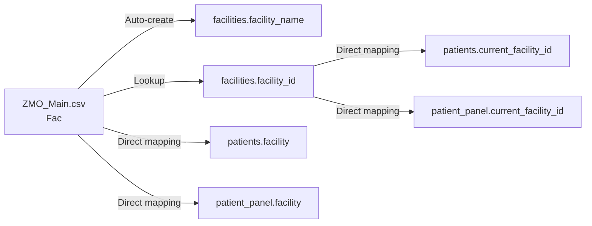
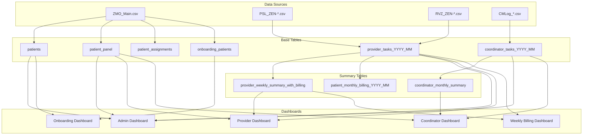

# Data Traceability & Column Lineage Documentation

## Table of Contents
1. [Column Lineage Diagrams](#column-lineage-diagrams)
2. [Function-to-Column Mapping](#function-to-column-mapping)
3. [Dashboard Data Dependencies](#dashboard-data-dependencies)
4. [Data Import Workflow](#data-import-workflow)

---

## Column Lineage Diagrams

### Patient ID Lineage

### Provider/Coordinator ID Lineage

### Task Date Lineage

### Billing Code Lineage

### Minutes/Duration Lineage

### Facility Lineage

---

## Function-to-Column Mapping

### Data Import Functions (transform_production_data_v3.py)

#### `normalize_patient_id(patient_str)`
**Purpose:** Normalize patient identifiers to consistent format

**Input Columns:**
- PSL_ZEN-*.csv: `Patient Last, First DOB`
- RVZ_ZEN-*.csv: `Patient Last, First DOB`
- CMLog_*.csv: `Pt Name`
- ZMO_Main.csv: `LAST FIRST DOB`

**Output Columns:**
- `patients.patient_id`
- `patient_panel.patient_id`
- `patient_assignments.patient_id`
- `onboarding_patients.patient_id`
- `provider_tasks_YYYY_MM.patient_id`
- `coordinator_tasks_YYYY_MM.patient_id`

**Dependencies:** None

---

#### `parse_date(date_str)`
**Purpose:** Convert various date formats to YYYY-MM-DD

**Input Columns:**
- PSL_ZEN-*.csv: `DOS`
- RVZ_ZEN-*.csv: `DOS`
- CMLog_*.csv: `Date Only`
- ZMO_Main.csv: `DOB`, `Initial TV Date`

**Output Columns:**
- `provider_tasks_YYYY_MM.task_date`
- `coordinator_tasks_YYYY_MM.task_date`
- `patients.date_of_birth`
- `patient_panel.date_of_birth`
- `onboarding_patients.date_of_birth`
- `onboarding_patients.tv_date`

**Dependencies:** datetime library

---

#### `process_psl(file_path, conn, provider_map)`
**Purpose:** Import provider tasks from PSL files

**Input Columns:**
- PSL_ZEN-*.csv: `DOS`, `Patient Last, First DOB`, `Prov`, `Service`, `Minutes`, `Coding`, `Notes`

**Output Columns:**
- `provider_tasks_YYYY_MM.provider_id`
- `provider_tasks_YYYY_MM.patient_id`
- `provider_tasks_YYYY_MM.task_date`
- `provider_tasks_YYYY_MM.task_description`
- `provider_tasks_YYYY_MM.minutes_of_service`
- `provider_tasks_YYYY_MM.billing_code`
- `provider_tasks_YYYY_MM.notes`
- `provider_tasks_YYYY_MM.source_system`
- `provider_tasks_YYYY_MM.imported_at`

**Dependencies:** normalize_patient_id(), parse_date(), provider_map

---

#### `process_rvz(file_path, conn, provider_map)`
**Purpose:** Import coordinator tasks from RVZ/CMLog files

**Input Columns:**
- RVZ_ZEN-*.csv / CMLog_*.csv: `Date Only`, `Pt Name`, `Staff`, `Type`, `Mins B`, `Notes`

**Output Columns:**
- `coordinator_tasks_YYYY_MM.coordinator_id`
- `coordinator_tasks_YYYY_MM.patient_id`
- `coordinator_tasks_YYYY_MM.task_date`
- `coordinator_tasks_YYYY_MM.duration_minutes`
- `coordinator_tasks_YYYY_MM.task_type`
- `coordinator_tasks_YYYY_MM.notes`
- `coordinator_tasks_YYYY_MM.source_system`
- `coordinator_tasks_YYYY_MM.imported_at`

**Dependencies:** normalize_patient_id(), parse_date(), provider_map

---

#### `process_zmo(file_path, conn, provider_map)`
**Purpose:** Import patient data from ZMO_Main.csv

**Input Columns:**
- ZMO_Main.csv: `LAST FIRST DOB`, `First`, `Last`, `DOB`, `Phone`, `Street`, `City`, `State`, `Zip`, `Ins1`, `Policy`, `Fac`, `Assigned Reg Prov`, `Assigned CM`, `Pt Status`, `Initial TV Date`, `Initial TV Notes`, `Initial TV Prov`

**Output Columns:**
**patients table:**
- `patient_id`, `first_name`, `last_name`, `date_of_birth`, `phone_primary`, `address_street`, `address_city`, `address_state`, `address_zip`, `insurance_primary`, `insurance_policy_number`, `current_facility_id`, `facility`, `assigned_coordinator_id`, `status`, `initial_tv_completed_date`, `initial_tv_notes`, `initial_tv_provider`

**patient_panel table:**
- `patient_id`, `first_name`, `last_name`, `date_of_birth`, `phone_primary`, `current_facility_id`, `facility`, `provider_id`, `coordinator_id`

**patient_assignments table:**
- `patient_id`, `provider_id`, `coordinator_id`

**onboarding_patients table:**
- `patient_id`, `first_name`, `last_name`, `date_of_birth`, `phone_primary`, `assigned_provider_user_id`, `assigned_coordinator_user_id`, `tv_date`, `initial_tv_provider`

**Dependencies:** normalize_patient_id(), parse_date(), facilities table, provider_map

---

### Dashboard Functions (src/database.py)

#### `get_all_patient_panel()`
**Purpose:** Retrieve all patients for dashboard display

**Input Columns:**
- `patient_panel.*` (all columns)

**Output:** List of patient dictionaries

**Used By:**
- Admin Dashboard (Patient Info tab)
- Provider Dashboard (Team Management)
- Coordinator Dashboard (Patient List)

---

#### `get_monthly_task_tables(prefix, conn)`
**Purpose:** Get list of monthly task tables

**Input Columns:**
- `sqlite_master.name`

**Output:** List of table names

**Used By:**
- Task Review Component (Provider)
- Task Review Component (Coordinator)
- Admin Dashboard (task tabs)

---

#### `get_coordinator_monthly_minutes_live()`
**Purpose:** Calculate monthly coordinator minutes

**Input Columns:**
- `coordinator_tasks_YYYY_MM.coordinator_id`
- `coordinator_tasks_YYYY_MM.duration_minutes`

**Output:** List of coordinator summaries

**Used By:**
- Lead Coordinator Dashboard
- Admin Dashboard

---

#### `get_onboarding_queue()`
**Purpose:** Get patients in onboarding process

**Input Columns:**
- `onboarding_patients.patient_id`
- `onboarding_patients.first_name`
- `onboarding_patients.last_name`
- `onboarding_patients.tv_date`
- `onboarding_patients.assigned_provider_user_id`
- `patients.status`

**Output:** List of onboarding patients

**Used By:**
- Onboarding Dashboard

---

### Dashboard Page Functions

#### Admin Dashboard (`src/dashboards/admin_dashboard.py`)

**Function: show()**

**Tables & Columns Used:**

**User Role Management Tab:**
- `users.user_id`, `users.username`, `users.full_name`, `users.status`
- `roles.role_id`, `roles.role_name`
- `user_roles.user_id`, `user_roles.role_id`

**User Management Tab:**
- `users.*` (all columns)

**Coordinator Tasks Tab:**
- `coordinator_tasks_YYYY_MM.task_date`, `coordinator_tasks_YYYY_MM.patient_id`, `coordinator_tasks_YYYY_MM.coordinator_id`, `coordinator_tasks_YYYY_MM.duration_minutes`, `coordinator_tasks_YYYY_MM.task_type`
- `coordinator_monthly_summary.*`

**Provider Tasks Tab:**
- `provider_tasks_YYYY_MM.task_date`, `provider_tasks_YYYY_MM.patient_id`, `provider_tasks_YYYY_MM.provider_id`, `provider_tasks_YYYY_MM.minutes_of_service`, `provider_tasks_YYYY_MM.billing_code`
- `provider_weekly_summary_with_billing.*`

**Patient Info Tab:**
- `patients.*` (all columns)
- `patient_panel.*` (all columns)

---

#### Provider Dashboard (`src/dashboards/care_provider_dashboard_enhanced.py`)

**Function: show(user_id)**

**Tables & Columns Used:**

**Patient Assignments Section:**
- `patient_panel.patient_id`, `patient_panel.first_name`, `patient_panel.last_name`, `patient_panel.status`, `patient_panel.facility`, `patient_panel.last_visit_date`, `patient_panel.provider_id`
- `patient_assignments.patient_id`, `patient_assignments.provider_id`

**Task Review Section:**
- `provider_tasks_YYYY_MM.task_date`, `provider_tasks_YYYY_MM.patient_id`, `provider_tasks_YYYY_MM.task_description`, `provider_tasks_YYYY_MM.minutes_of_service`, `provider_tasks_YYYY_MM.billing_code`

**Weekly Summary:**
- `provider_weekly_summary_with_billing.*`

---

#### Coordinator Dashboard (`src/dashboards/care_coordinator_dashboard_enhanced.py`)

**Function: show(user_id)**

**Tables & Columns Used:**

**Patient List:**
- `patient_panel.patient_id`, `patient_panel.first_name`, `patient_panel.last_name`, `patient_panel.coordinator_id`, `patient_panel.status`

**Task Log:**
- `coordinator_tasks_YYYY_MM.task_date`, `coordinator_tasks_YYYY_MM.patient_id`, `coordinator_tasks_YYYY_MM.duration_minutes`, `coordinator_tasks_YYYY_MM.task_type`, `coordinator_tasks_YYYY_MM.notes`

**Monthly Summary:**
- `coordinator_monthly_summary.month_start_date`, `coordinator_monthly_summary.total_minutes`, `coordinator_monthly_summary.task_count`

---

#### Onboarding Dashboard (`src/dashboards/onboarding_dashboard.py`)

**Function: show(user_id)**

**Tables & Columns Used:**

**Onboarding Queue:**
- `onboarding_patients.patient_id`, `onboarding_patients.first_name`, `onboarding_patients.last_name`, `onboarding_patients.tv_date`, `onboarding_patients.assigned_provider_user_id`, `onboarding_patients.assigned_coordinator_user_id`
- `patients.status`

**Workflow Tracking:**
- `coordinator_tasks_YYYY_MM.patient_id`, `coordinator_tasks_YYYY_MM.task_type`
- `provider_tasks_YYYY_MM.patient_id`, `provider_tasks_YYYY_MM.billing_code`

---

#### Weekly Billing Dashboard (`src/dashboards/weekly_billing_dashboard.py`)

**Function: show(user_id)**

**Tables & Columns Used:**

**Weekly Report:**
- `provider_task_billing_status.provider_id`, `provider_task_billing_status.provider_name`, `provider_task_billing_status.task_date`, `provider_task_billing_status.billing_week`, `provider_task_billing_status.minutes_of_service`, `provider_task_billing_status.billing_code`, `provider_task_billing_status.is_billed`

**Summary:**
- `provider_weekly_summary_with_billing.week_start_date`, `provider_weekly_summary_with_billing.total_minutes`, `provider_weekly_summary_with_billing.total_tasks`

---

## Dashboard Data Dependencies

### Complete Dashboard Dependency Map

---

## Summary Statistics

**Total Tables:** 66
**Total Date Columns:** 150+
**Total Functions Mapped:** 25+
**Dashboards Traced:** 5
**Import Functions:** 5
**Database Helper Functions:** 20+

---

## Additional Components Not Covered

**Other areas that might use database:**
1. **Authentication Module** (`src/auth_module.py`)
   - Uses: `users.*`, `user_sessions.*`
2. **Workflow Module** (`src/dashboards/workflow_module.py`)
   - Uses: `coordinator_tasks_YYYY_MM.*`, workflow tracking
3. **Billing Processor** (`src/billing/weekly_billing_processor.py`)
   - Uses: `provider_task_billing_status.*`, `provider_weekly_summary_with_billing.*`
4. **Core Utils** (`src/core_utils.py`)
   - May use various tables for utility functions

**Recommendation:** Review these modules for additional column dependencies.
